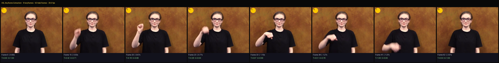
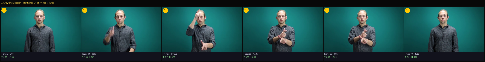
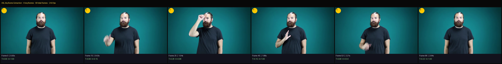

## WLASL Video Keyframe Extractor

> [!NOTE]
> This tool is currently experimental and may not be accurate in all cases. Adjust the parameters accordingly for better results

### Setup:

```bash
uv venv --python 3.11
uv init .
uv add mediapipe==0.10.9
uv add torch torchvision opencv-python scipy numpy Pillow
uv add torchvision --index https://download.pytorch.org/whl/cu118
```

<br>

### Usage:

```bash
# BASIC USAGE (all defaults)
uv run asl_keyframe_extractor.py path/to/sign.mp4

# FULL USAGE WITH ALL ARGS
uv run asl_keyframe_extractor.py path/to/sign.mp4 \
  --output-dir    ./out \       # Where to save the output images. Default: current dir
  -i \                          # Save each keyframe as an individual image (frame_0.png, ...)
  -s \                          # Save stitched keyframe strip image
  --min-frames    8 \           # Minimum keyframes to extract. Default: 8
  --max-frames    15 \          # Maximum keyframes to extract. Default: 15
  --thumb-height  256 \         # Height (px) of each thumbnail in output image. Default: 256
  --mp-complexity 1 \           # MediaPipe model: 0=fast, 1=balanced, 2=accurate. Default: 1
  --hold-threshold 0.12 \       # Sandwiched hold sensitivity. Lower = catches subtler holds.
                                #   Try 0.08 if holds are still being missed.
                                #   Try 0.15 if too many spurious frames appear. Default: 0.12
  --smooth-sigma  2.0           # Gaussian smoothing on the motion signal.
                                #   Lower (1.0–1.5) = sharper peaks, better for fast signs.
                                #   Higher (2.5–3.0) = smoother, better for slow/noisy videos.
                                #   Default: 2.0


# PRACTICAL EXAMPLES:

# Fast signer / short clip — tighter smoothing, lower hold threshold
uv run asl_keyframe_extractor.py dataset/go.mp4 \
  --output-dir ./out \
  --smooth-sigma 1.5 \
  --hold-threshold 0.08

# Slow signer / longer clip — more smoothing, fewer frames needed
uv run asl_keyframe_extractor.py dataset/why.mp4 \
  --output-dir ./out \
  --min-frames 6 \
  --max-frames 10 \
  --smooth-sigma 2.5

# Maximum accuracy (slower, worth it for hard signs)
uv run asl_keyframe_extractor.py dataset/sign.mp4 \
  --output-dir ./out \
  --mp-complexity 2 \
  --hold-threshold 0.08 \
  --smooth-sigma 1.5

# Batch process all mp4s in a folder (bash loop)
for video in dataset/raw/*.mp4; do
  uv run asl_keyframe_extractor.py "$video" --output-dir ./out
done


# OUTPUTS:
# 1. Console table — frame indices, timestamps, T score and H score per keyframe
# 2. Individual PNGs (if -i used) — separate frame images saved to --output-dir (frame_0.png, frame_1.png, ...)
# 3. Stitched image (if -s used)  — stitched side-by-side keyframe strip saved to --output-dir
#                                   filename pattern: {video_stem}_keyframes.png
#                                   e.g.  out/go_keyframes.png
```

<br>

### Example:

Running the script on Word Level ASL video for the word sign - "Yes":

```
uv run .\asl_keyframe_extractor.py dataset\raw_video_data\yes\yes_64280.mp4 --output-dir .\out\ --min-frame 8 --max-frame 10 --hold-threshold 0.06
```

<br>

Received the keyframe output:
```

━━━  STAGE 1/4 — Loading Video  ━━━━━━━━━━━━━━━━━━━━━━━━━━━━━
[load]  63 frames  |  30.0 fps  |  320×240

━━━  STAGE 2/4 — MediaPipe Landmark Signals  ━━━━━━━━━━━━━━━━━
[mediapipe]  Processing 63 frames …
INFO: Created TensorFlow Lite XNNPACK delegate for CPU.
         95%  frame 60/62
[mediapipe]  Hands detected in 27/63 frames (43%)

━━━  STAGE 3/4 — Optical Flow Signals  ━━━━━━━━━━━━━━━━━━━━━━━
[flow]  Computing Farneback flow for 62 frame pairs …
[flow]  Done.

━━━  STAGE 4/4 — Signal Fusion + Keyframe Selection  ━━━━━━━━━
[select]  +2 sandwiched hold(s) at frames: [np.int64(20), np.int64(33)]
[select]  8 keyframes selected (min=8, max=10)

╔════════════════════════════════════════════════════════════════╗
║                ASL KEYFRAME EXTRACTION RESULTS                 ║
╠════════════════════════════════════════════════════════════════╣
║                   Total keyframes selected : 8                 ║
╠════╦═════════╦═══════════╦══════════════════╦══════════════════╣
║   #║  Frame  ║  Time(s)  ║  Trans Score     ║  Hold Score      ║
╠════╬═════════╬═══════════╬══════════════════╬══════════════════╣
║  1 ║      0  ║    0.000  ║  0.000 ░░░░░░░░  ║  1.000 ███████░  ║
║  2 ║     15  ║    0.501  ║  0.416 ███░░░░░  ║  0.712 █████░░░  ║
║  3 ║     20  ║    0.667  ║  0.180 █░░░░░░░  ║  0.975 ███████░  ║
║  4 ║     23  ║    0.767  ║  0.280 ██░░░░░░  ║  0.944 ███████░  ║
║  5 ║     33  ║    1.101  ║  0.072 ░░░░░░░░  ║  0.995 ███████░  ║
║  6 ║     38  ║    1.268  ║  0.508 ████░░░░  ║  0.784 ██████░░  ║
║  7 ║     41  ║    1.368  ║  1.000 ███████░  ║  0.000 ░░░░░░░░  ║
║  8 ║     62  ║    2.069  ║  0.041 ░░░░░░░░  ║  1.000 ███████░  ║
╚════╩═════════╩═══════════╩══════════════════╩══════════════════╝

  Keyframe index list  : [0, 15, 20, 23, 33, 38, 41, 62]
  Timestamps (seconds) : [0.0, 0.501, 0.667, 0.767, 1.101, 1.268, 1.368, 2.069]

[output]  Stitched keyframe strip → .\out\yes_64280_keyframes.png
Done.
  Keyframe indices : [0, 15, 20, 23, 33, 38, 41, 62]
  Timestamps (s)   : [0.0, 0.501, 0.667, 0.767, 1.101, 1.268, 1.368, 2.069]
  Output image     : .\out\yes_64280_keyframes.png

```

<br>

Selected keyframes:


<br>

More examples:
- Running script on ASL video for the word "brother":
`uv run .\asl_keyframe_extractor.py dataset\raw_video_data\brother\brother_65262.mp4 --output-dir .\out\ --min-frame 4 --max-frame 6 --hold-threshold 0.08`

The selected keyframes are:


<br>

- For the word "man":
`uv run .\asl_keyframe_extractor.py dataset\raw_video_data\man\man_66098.mp4 --output-dir .\out\ --min-frame 4 --max-frame 6 --hold-threshold 0.08`

The selected keyframes are:
